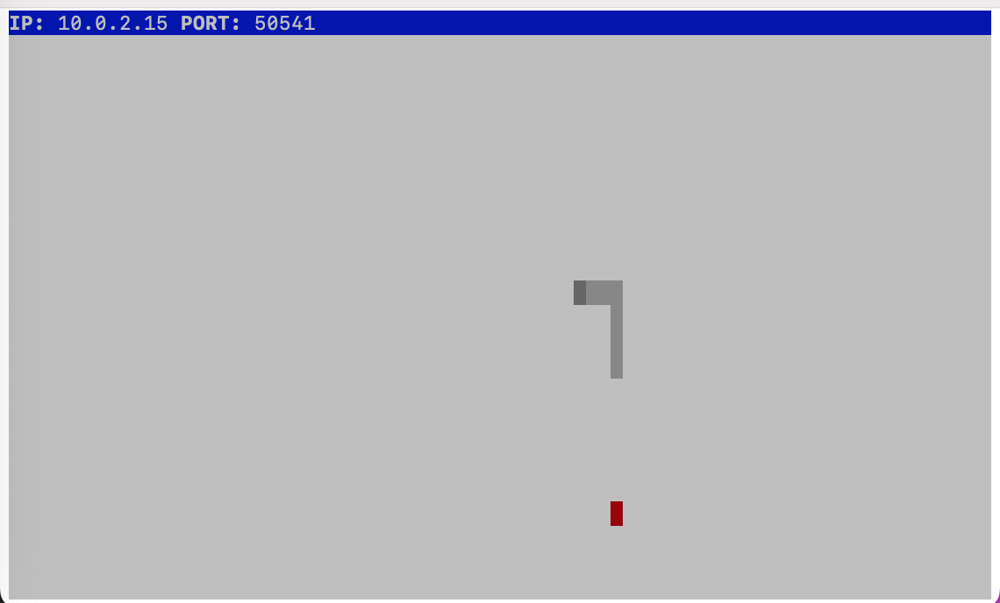

## Snake Client Project
Welcome to the Snake Client project! This is a multiplayer version of the classic Snake game where players maneuver a growing snake while avoiding obstacles and the boundaries of the game area. The objective of the game is to grow yoursnake by eating food while avoiding collisions with the walls and your own tail.

To get started, you'll need to ensure that the server side of the multiplayer game is up and running. You can download and install the server from [here.](https://github.com/lighthouse-labs/snek-multiplayer)

## Getting Started
1. Clone the snek-multiplayer repository to your local machine.
2. Follow the instructions provided in the snek-multiplayer repository to set up and run the server side.

Once the server is running, you can proceed to run the Snake Client and join the multiplayer fun!

## Installation and Setup
1. Clone this Snake Client repository to your local machine.
2. Navigate to the project directory in your terminal.

## Running the Snake Client
To start playing the Snake game:

1. Make sure the server side is up and running as per the instructions provided in the snek-multiplayer repository.
2. In the terminal, run the Snake Client using the following command: `node play.js`

## Gameplay Instructions
Use the WASD keys on your keyboard to navigate your snake:

W - Move Up  
A - Move Left  
S - Move Down  
D - Move Right  

E - Prints messages to screen next to your snake for a short period of time. 

## Final Product

## Quitting the Game
To quit the game and stop the Snake Client, press CTRL + C in the terminal where the game is running.

Happy gaming! 🐍

